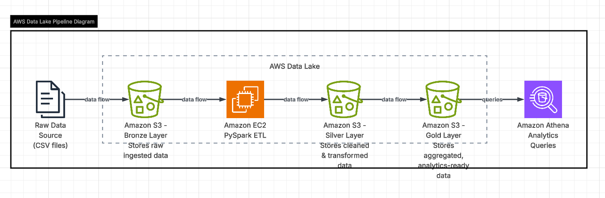

# 🚀 AWS Data Lake using Medallion Architecture

A scalable cloud-native AWS Data Lake project built to ingest, process, transform, and analyze large-scale datasets using Medallion Architecture principles. This project demonstrates modern data engineering workflows with automated ETL pipelines, layered storage architecture, and analytics-ready datasets.

---

# 📌 Project Overview

Organizations generate massive amounts of raw data from multiple systems in different formats. Traditional systems often struggle with scalability, performance, and cost optimization.

This project demonstrates how to build a modern AWS-based Data Lake capable of handling raw and processed datasets efficiently while enabling scalable analytics and business intelligence workflows.

The solution uses a layered Medallion Architecture approach with Bronze, Silver, and Gold layers for better data governance, maintainability, and analytical processing.

---

# 🏗️ Architecture Diagram

The following architecture demonstrates the end-to-end AWS Data Lake pipeline using Medallion Architecture principles.

  

### 🥉 Bronze Layer
- Stores raw ingested data
- Immutable storage for source datasets
- Supports structured and semi-structured data

### 🥈 Silver Layer
- Cleans and transforms raw datasets
- Handles null values and duplicate records
- Standardizes schema and improves data quality

### 🥇 Gold Layer
- Stores business-ready analytical datasets
- Aggregated and optimized for reporting
- Supports fast querying and analytics

---

## Pipeline Explanation

1. Raw CSV datasets are ingested into Amazon S3 Bronze layer  
2. PySpark ETL jobs process the raw datasets  
3. Cleaned and transformed data is stored in Silver layer  
4. Aggregated analytics-ready datasets are stored in Gold layer  
5. Amazon Athena performs serverless analytical querying  

# ⚙️ End-to-End Workflow

1. Raw datasets are ingested into Amazon S3 Bronze layer  
2. AWS Glue ETL jobs process and clean the data  
3. Cleaned datasets are stored in Silver layer  
4. Aggregations and business transformations generate Gold datasets  
5. Amazon Athena is used for serverless SQL querying  
6. BI dashboards and analytical systems consume Gold datasets  

---

# 🛠️ Tech Stack

| Category | Technology |
|---|---|
| Cloud Platform | AWS |
| Storage | Amazon S3 |
| Processing | AWS Glue, PySpark |
| Query Engine | Amazon Athena |
| Data Catalog | AWS Glue Catalog |
| Workflow Orchestration | AWS Glue Workflows |
| Programming Language | Python, SQL |
| File Formats | CSV, Parquet |
| Architecture | Medallion Architecture |

---

# 🔥 Key Features

- Built scalable AWS-based Data Lake architecture
- Implemented Medallion Architecture design pattern
- Developed automated ETL pipelines using PySpark
- Stored raw and transformed datasets in Amazon S3
- Enabled serverless analytics using Amazon Athena
- Applied partitioning and Parquet optimization techniques
- Improved data quality through transformation pipelines
- Created analytics-ready business datasets
- Designed modular and reusable ETL workflows

---
